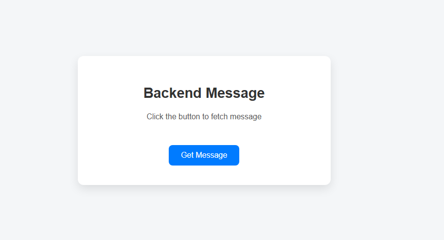
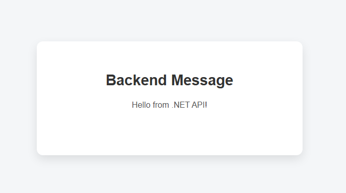

# ⚡ MyDotnetAngularApp – Fullstack Starter (ASP.NET Core + Angular)

A beginner-friendly **full-stack web app** developed using **ASP.NET Core (Backend)** and **Angular (Frontend)**.  
This project demonstrates the fundamental integration between a **.NET API** and an **Angular UI**, where the frontend fetches and displays a message served by the backend.

---

## 📌 About the Project
This is a **simple full-stack project** built with **ASP.NET Core Web API (Backend)** and **Angular (Frontend)**.  
The app demonstrates how to connect an Angular frontend with a .NET backend and fetch data via an API call.

✅ **Backend**: ASP.NET Core Web API with a `HelloController` returning a message.  
✅ **Frontend**: Angular standalone component using `HttpClient` to fetch and display the message.  

---

## 🛠️ Technologies Used

### Frontend
- **Angular 17** with standalone components
- **HttpClient** for API calls
- **TypeScript**
- **HTML/CSS**

### Backend
- **ASP.NET Core 8.0** (Web API)
- **C#**
- **Controller-based routing**
- **IActionResult** for HTTP responses

---

## 🎯 Future Improvements
- Add more API endpoints (e.g., return JSON objects).
- Display backend data in Angular table/list.
- Implement POST requests with Angular forms.

---

## 📸 Screenshot
**Before fetching message:**

**After fetching message:**

---

## 🚀 Author
 **Safeeya Munawwar**

  
  
  
  
  

© 2025 MyDotnetAngularApp | Built with ❤️ using Angular + ASP.NET Core
